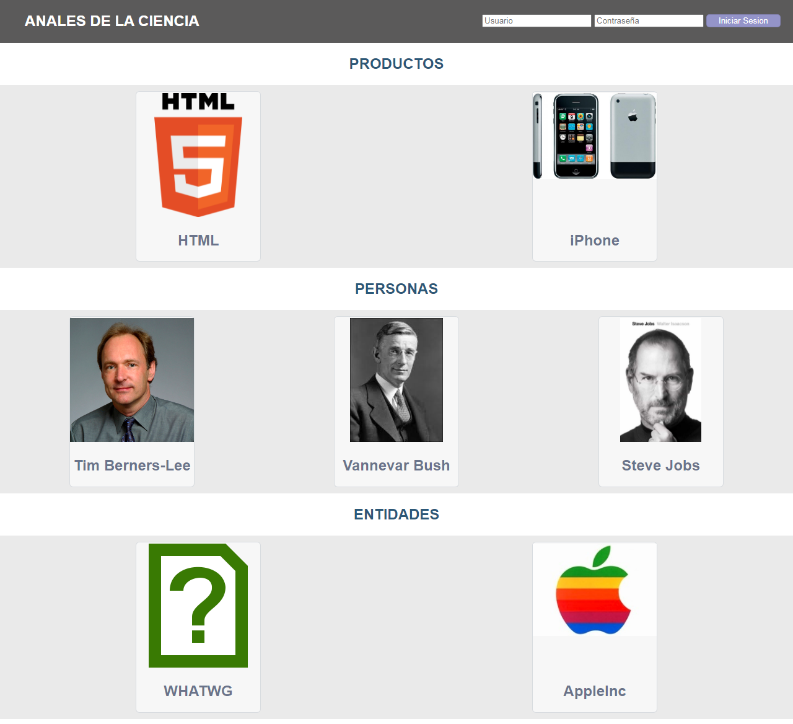
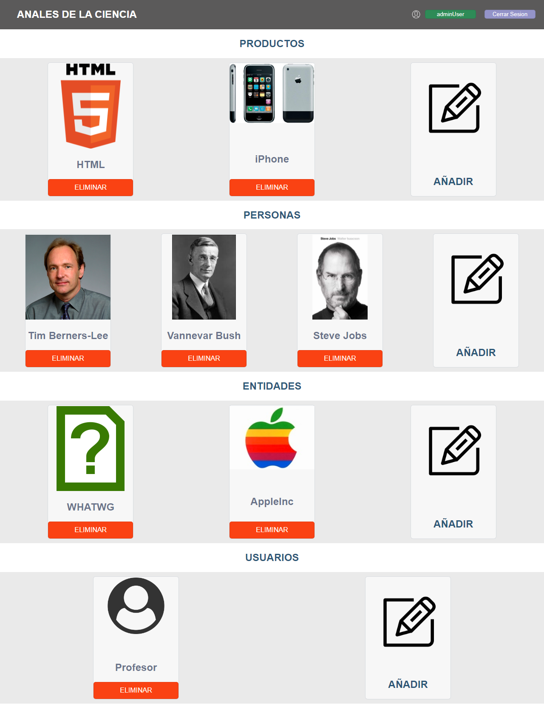

Web de gestion de Productos, Entidades y Personas.

Para hacer más sencilla la gestión de los datos se ha utilizado
el ORM [Doctrine][doctrine]. Doctrine 2 es un Object-Relational Mapper que proporciona
persistencia transparente para objetos PHP. Utiliza el patrón [Data Mapper][dataMapper]
con el objetivo de obtener un desacoplamiento completo entre la lógica de negocio y la
persistencia de los datos en los sistemas de gestión de bases de datos.

Para su configuración, este proyecto se apoya en el componente [Dotenv][dotenv], que
permite realizar la configuración a través de variables de entorno. De esta manera,
cualquier configuración que pueda variar entre diferentes entornos (desarrollo, pre-producción, producción, ...) puede ser establecida
a través de variables de entorno, tal como se aconseja en la metodología [“The twelve-factor app”][12factor] ✔️.

## ⚙Instalación del proyecto️

El primer paso consiste en generar un esquema de base de datos vacío y un usuario/contraseña
con privilegios completos sobre dicho esquema.

> composer install

## 🗄️Estructura del proyecto

A continuación se describe el contenido y estructura más destacado del proyecto:

* Directorio `bin`:
    - Ejecutables (*doctrine*, *phpunit*, ...)
* Directorio `config`:
    - `config/cli-config.php`: configuración de la consola de comandos de Doctrine,
      configuración de la aplicación, asociación entre rutas y controladores, etc.
* Directorio `src`:
    - Subdirectorio `src/Entity`: entidades PHP (incluyen anotaciones de mapeo del ORM)
    - Subdirectorio `src/Controller`: controladores PHP (implementan los _endpoints_ de la API)
    - Subdirectorio `src/scripts`: scripts de ejemplo
* Directorio `public`:
    - Raíz de documentos del servidor web
(Swagger-UI)
    - `public/demoAjax`: ejemplo básico acceso a la API (login)
* Directorio `tests`:
    - Pruebas unitarias y funcionales de la API
* Directorio `vendor`:
    - Componentes desarrollados por terceros (Doctrine, DotENV, Slim, etc.)

## 🚀Puesta en marcha de la aplicación

Para acceder a la aplicación utilizando el servidor interno del intérprete
de PHP se ejecutará el comando:

```
> php -S 127.0.0.1:8000 -t public
```

Index:



